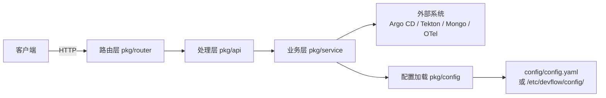

# Devflow 文档（Codex）

## 概述
Devflow 是一个基于 Go 的 API 服务，使用 Gin 作为路由层，业务逻辑集中在 `pkg/service`，并通过配置驱动外部依赖（如 Argo CD、Tekton、Mongo、OTel 等集成模块）。配置既支持本地 `config/config.yaml`，也可从 `/etc/devflow/config/` 加载。

## 架构图（Mermaid）


## 模块说明
- `cmd/main.go`：服务入口，启动路由与依赖初始化。
- `pkg/router/`：Gin 路由与中间件。
- `pkg/api/`：请求/响应模型与 Handler。
- `pkg/service/`：业务逻辑与外部系统集成。
- `pkg/config/`：配置加载与客户端初始化。
- `config/config.yaml`：本地默认配置。
- `docs/`：Swagger 输出（由 `swag` 生成，勿手动修改）。

## 典型请求流程
1. 客户端发起 HTTP 请求。
2. `pkg/router` 将请求分发到对应 Handler。
3. `pkg/api` 中的 Handler 解析请求并调用 `pkg/service`。
4. `pkg/service` 执行业务逻辑，必要时访问外部系统或数据库。
5. 返回响应给客户端。

## 接口示例
以下示例以 `http://localhost:8080` 为基础地址，按需替换。

### 获取应用列表
```bash
curl -X GET "http://localhost:8080/api/v1/applications"
```

示例响应：
```json
[
  {
    "id": "app_001",
    "name": "web-portal",
    "project_name": "demo",
    "repo_url": "https://git.example.com/demo/web-portal",
    "replica": 2,
    "internet": "external",
    "status": "Running"
  }
]
```

### 创建 Manifest
```bash
curl -X POST "http://localhost:8080/api/v1/manifests" \
  -H "Content-Type: application/json" \
  -d '{
    "application_id": "app_001",
    "application_name": "web-portal",
    "branch": "main",
    "git_repo": "https://git.example.com/demo/web-portal",
    "replica": 2,
    "internet": "external"
  }'
```

示例响应：
```json
{
  "id": "manifest_001",
  "name": "web-portal-main-20240201",
  "application_id": "app_001",
  "branch": "main",
  "git_repo": "https://git.example.com/demo/web-portal",
  "status": "Pending"
}
```

### Patch Manifest（更新 digest / commit_hash）
```bash
curl -X PATCH "http://localhost:8080/api/v1/manifests/manifest_001" \
  -H "Content-Type: application/json" \
  -d '{
    "commit_hash": "a1b2c3d4",
    "digest": "sha256:1111111111111111111111111111111111111111111111111111111111111111"
  }'
```

示例响应：
```json
{
  "message": "ok"
}
```

## 配置与运行
- 本地运行：`go run ./cmd`（默认读取 `config/config.yaml`）。
- 构建二进制：`go build -o devflow cmd/main.go`。
- 生成 Swagger：`swag init -g cmd/main.go --parseDependency`。

## 运行时依赖
- 需要有效 kubeconfig：`$HOME/.kube/config` 或集群内配置。
- 若使用容器构建：`docker build -t devflow:local .`（会生成 Swagger）。

## 维护与扩展建议
- 新增 API 时优先在 `pkg/api` 与 `pkg/service` 分层实现。
- 配置项新增时同步更新 `config/config.yaml`。
- 若路由或模型变更，重新生成 Swagger 并检查 `docs/`。
